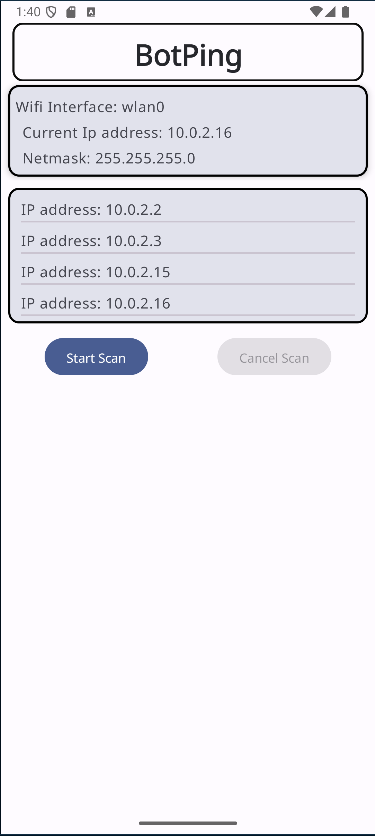

# BotPing

## Disclaimer
This application should only be used for learning or developing purposes and within a home network where the application is authorized to run and perform. 

## Introduction
A Jetpack compose application that performs network reconnaissance to find all active IP addresses on a Wifi network. 

## Process
On startup, the application checks to see if you are on a valid Wifi network, you can then scan the network work. Application will only scan on a Wifi network.

## Tools
- Kotlin 
- Jetpack Compose